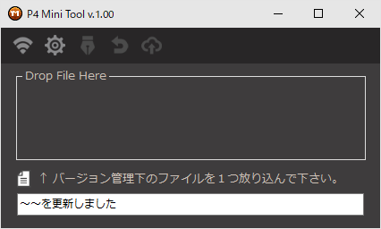

# お読みください
シンプルでコンパクトなチェックアウト＆サブミットツール

　  
　  

**◆『P4MiniTool』について**  
　  
　こちらが本ツールの紹介記事になります。  
　[https://effect.hatenablog.com/entry/p4minitool](https://effect.hatenablog.com/entry/p4minitool) 
　  
　使用時は MT_P4MiniTool_v100.exe を実行してください。  
　ツール上部のアイコンにカーソルを置くと説明文が表示されます。  
　  
　不具合報告は下記までお願いします。  
　https://twitter.com/moko_03_25  
　  
moko

**◆更新履歴**  
　  
　2020.09.14 ver.1.00  
　　リリースしました！  

**◆使用アイコンについて**  
　  
　binaryにはこちらのフリーアイコン素材を使用させて頂いていますが、GitHub内のリソースには含んでいません。  
　『Free Icon Pack: 375 Retina-Display-Ready Icons』    
　　https://www.webpagefx.com/blog/web-design/375-retina-display-ready-icons/  

**◆P4 APT for .NET について**

こちらのDLLを同梱させていただいています。  
　  
ライセンスは「BSD 2-Clause "Simplified" License」になります。  
https://github.com/perforce/p4api.net/blob/master/LICENSE.txt  
　  
Copyright (c) 2011-2020, Perforce Software, Inc.  All rights reserved.  
　  
Redistribution and use in source and binary forms, with or without  
modification, are permitted provided that the following conditions are met:  
　  
1.  Redistributions of source code must retain the above copyright  
    notice, this list of conditions and the following disclaimer.  
　  
2.  Redistributions in binary form must reproduce the above copyright  
    notice, this list of conditions and the following disclaimer in the  
    documentation and/or other materials provided with the distribution.  
　  
THIS SOFTWARE IS PROVIDED BY THE COPYRIGHT HOLDERS AND CONTRIBUTORS  
"AS IS" AND ANY EXPRESS OR IMPLIED WARRANTIES, INCLUDING, BUT NOT  
LIMITED TO, THE IMPLIED WARRANTIES OF MERCHANTABILITY AND FITNESS  
FOR A PARTICULAR PURPOSE ARE DISCLAIMED. IN NO EVENT SHALL PERFORCE  
SOFTWARE, INC. BE LIABLE FOR ANY DIRECT, INDIRECT, INCIDENTAL,  
SPECIAL, EXEMPLARY, OR CONSEQUENTIAL DAMAGES (INCLUDING, BUT NOT  
LIMITED TO, PROCUREMENT OF SUBSTITUTE GOODS OR SERVICES; LOSS OF USE, 
DATA, OR PROFITS; OR BUSINESS INTERRUPTION) HOWEVER CAUSED AND ON  
ANY THEORY OF LIABILITY, WHETHER IN CONTRACT, STRICT LIABILITY, OR  
TORT (INCLUDING NEGLIGENCE OR OTHERWISE) ARISING IN ANY WAY OUT OF  
THE USE OF THIS SOFTWARE, EVEN IF ADVISED OF THE POSSIBILITY OF SUCH  
DAMAGE. 
